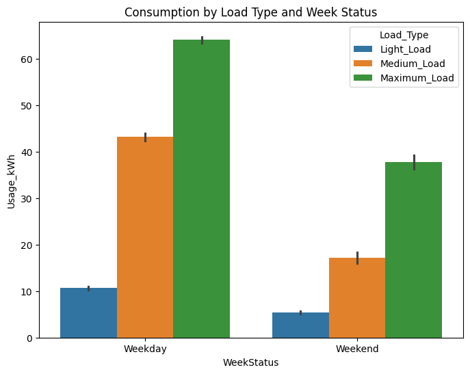
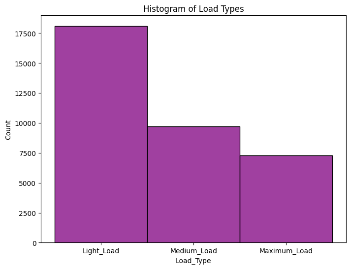

# **Steel Industry Analysis Summary**

# **High Level Overview**
* Weekdays have a higher usage than weekends
  
* There is not any trends between the various months
* Majority of the data in the dataset is a light load

* The average usage during the weekdays is between 30-35
